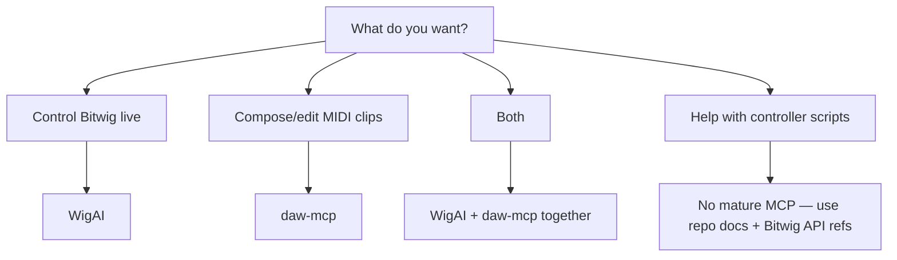

# Bitwig MCP Landscape

There is no single "official" Bitwig MCP. The mature options fall into three camps: **native Bitwig extensions with embedded MCP**, **external bridge servers**, and **specialized MIDI/clip tools**. None explicitly claim Bitwig 6 support yet; all target Bitwig 5.2+ and should be treated as "likely works on 6 beta, verify locally."

This repo uses **WigAI** as the project-local MCP for pulling live project structure from Bitwig. See [wigai-setup.md](./wigai-setup.md).

---

## Quick comparison

| Project | Maturity | Last activity | Integration | Best for | Cursor fit |
|---------|----------|---------------|-------------|----------|------------|
| [fabb/WigAI](https://github.com/fabb/WigAI) | **Highest** | Apr 2026 | `.bwextension`, HTTP MCP | General DAW control via Controller API | HTTP endpoint |
| [ptaczek/daw-mcp](https://github.com/ptaczek/daw-mcp) | **Good, focused** | Jan 2026 | `.bwextension` + Node bridge | MIDI clip read/write in Session view | Excellent via stdio `node` |
| [WeModulate/bitwig-mcp-server](https://github.com/WeModulate/bitwig-mcp-server) | **Stale** | Apr 2025 | Python server + OSC via DrivenByMoss | Basic transport/mixer if you already use Moss | Good via stdio Python |
| [audio-forge-rs/skipper + Gilligan](https://github.com/audio-forge-rs/skipper) | **Early** | Active but tiny | Rust plugin + Java extension | Beat-synced AI workflows | SSE at `localhost:61170` |
| [csabacsaba/WigAI](https://github.com/csabacsaba/WigAI) | **Experimental fork** | Nov 2025 | WigAI fork | Extra clip/device tools | Same as WigAI |

---

## Tier 1: Actually mature

### 1. WigAI — best default for general Bitwig control

**Repo:** https://github.com/fabb/WigAI

**Why it stands out**
- Native Bitwig Controller Extension (Java), not OSC hacks
- Embedded MCP server at `http://localhost:61169/mcp`
- Active maintenance: created May 2025, last push **Apr 2026**, automated releases via Nyx
- ~53 stars, 16 forks, community discussion on [KVR](https://www.kvraudio.com/forum/viewtopic.php?t=624892)
- Uses the same Controller API family as scripts in `./bitwig6/`

**Capabilities (expanded beyond README)**
- Transport: play/stop
- Project status and metadata
- Tracks: list, details
- Scenes/clips: list scenes, clips in scene, launch
- Devices: list on track, device details, selected-device parameter control

**Requirements**
- Bitwig 5.2.7+
- Java 21 (for building; releases ship `.bwextension`)
- Install to `%USERPROFILE%\Documents\Bitwig Studio\Extensions\`, activate in Bitwig preferences

**Known gaps**
- [WigAI issue #15](https://github.com/fabb/WigAI/issues/15): deep device parameter access independent of UI remote-control page is still unresolved
- README still understates tool surface; releases/changelog are the better source of truth

**Cursor config sketch**
```json
{
  "mcpServers": {
    "wigai": {
      "url": "http://localhost:61169/mcp"
    }
  }
}
```
Bitwig must be running with WigAI enabled.

---

### 2. daw-mcp — best for AI-assisted MIDI composition

**Repo:** https://github.com/ptaczek/daw-mcp

**Why it is mature**
- Polished README, release ZIP (`daw-mcp-0.8.2`), Windows paths documented
- Clear scope and limitations (honest about what it does not do)
- Created Dec 2025, last push Jan 2026
- Also supports Ableton if you use both DAWs

**Capabilities**
- Read/write MIDI notes in **Session/Clip Launcher view**
- Clip analysis (key, chords, patterns)
- Cross-DAW clip transfer (Bitwig ↔ Ableton)

**Explicitly out of scope**
- Arrangement view
- Audio clips, automation, mixing
- Real-time generative playback

**Architecture**


**Cursor config sketch (Windows)**
```json
{
  "mcpServers": {
    "daw": {
      "command": "cmd",
      "args": ["/c", "node", "C:\\path\\to\\mcp-server.js"]
    }
  }
}
```
Install extension via **Settings → Controllers → PX-Audio → Bitwig MCP Bridge**.

---

## Tier 2: Usable but weaker fit

### 3. WeModulate/bitwig-mcp-server — popular but aging

**Repo:** https://github.com/WeModulate/bitwig-mcp-server

**Pros**
- Most GitHub stars (~65)
- Python MCP with stdio transport
- MCP resources (`bitwig://tracks`, etc.) and prompt templates

**Cons**
- **Last code push: Apr 2025** — effectively maintenance-frozen
- Depends on [DrivenByMoss](https://www.mossgrabers.de/Software/Bitwig/Bitwig.html) OSC setup, not direct Controller API
- OSC layer is coarser and less aligned with controller-script work

**Verdict:** Only worth it if you already run DrivenByMoss and want a quick OSC bridge. Otherwise WigAI is strictly better for Bitwig-native control.

---

## Tier 3: Watch list, not "mature" yet

### 4. Skipper + Gilligan (audio-forge-rs)

**Repo:** https://github.com/audio-forge-rs/skipper

- Gilligan is a WigAI-inspired controller extension with MCP at `http://localhost:61170/sse`
- Skipper is a per-track Rust CLAP/VST3 plugin for sample-accurate beat sync
- Ambitious architecture, but ~1 star and early stage
- Pick this only if you want beat-synced multi-track AI orchestration and accept bleeding-edge risk

### 5. Groove Link (audio-forge-rs)

**Repo:** https://github.com/audio-forge-rs/groove-link

- Despite the folder name, this is **not MCP** — it is a Python CLI + TCP proxy
- Useful for Claude Code/bash workflows, not Cursor MCP tools

### 6. csabacsaba/WigAI fork

**Repo:** https://github.com/csabacsaba/WigAI

- Experimental fork with more clip/device tooling (track colors, richer clip IO)
- Author on KVR says it is not maintained for bugfixes
- Treat as a sandbox, not production

---

## Recommendation matrix



| Goal | Pick |
|------|------|
| Transport, tracks, scenes, devices | **WigAI** |
| AI reads/writes MIDI in clips | **daw-mcp** |
| Both workflows | **WigAI + daw-mcp** (complementary, different ports) |
| Controller script development in this repo | **No good MCP exists** — `./references/bitwig/bitwig-6-api-documentation.md` and live Bitwig testing remain the right path |
| Beat-synced generative production | Watch **Skipper/Gilligan**, not production-ready |

---

## Bitwig 6 beta notes

- WigAI and daw-mcp target **5.2.x+**; Bitwig 6 beta may work but is unverified
- This repo targets **API v25 / Bitwig 6** for new scripts — WigAI is Java Controller API, same ecosystem but separate codebase
- Test plan after install:
  1. Extension loads without controller-console errors
  2. MCP endpoint responds while Bitwig is open
  3. One read tool (project/tracks) and one write tool (transport or clip) succeed
